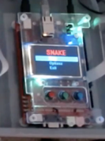
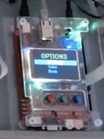
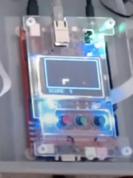

# SNAKE GAME

A snake game made to run specifically on the Microzed Evaluation Kit (Xylinx Zynq 7Z010).

## Before the Game

### Loading

- Wait until the loading animation on the LED strip is finished.
- After that select an option from the main menu.

### Main Menu

#### Navigation

- Navigate using W key (up) and S key (down). Press the return key to confirm your selection.

#### Start game

- Starts a new game with selected parameters. If none are selected, then default parameters are used.

#### Options

- Opens the options menu.

#### Exit game

- Exits the game.

### Options Menu

#### Difficulty

- Normal
  - Wall collisions are off. The player can freely exit the board and reappear on the other side.
- Hard
  - Wall collisions are on. A collision with any wall will result into an immediate loss.

#### Color

- Pick color of your snake here. Red, Blue or White.

#### Back

- Exits to the main menu.

## Gameplay

### Score

- Keeps track of the score and updates it.

### Goal

- Eat the berry marked on the board to grow one square in length. 
- Reach level 100 to win the game.

### Control

- Control the snake on the screen using the WSAD keys. 
- Press ESC to exit the game.
- Eating the berry is signaled by the green LEDs flashing.
- Death is signaled by the red LEDs flashing.

\- a project by Nikita Lepikhin
